# 1) Elicitación 

## User Personas

Parte del trabajo de investigación incluyó la creación de 5 diferentes User Personas, a continuación se detalla cada uno de los casos. Se eligieron personas de diferentes edades y con diferentes actividades diarias (trabajo, estudio, ocio, etc.).

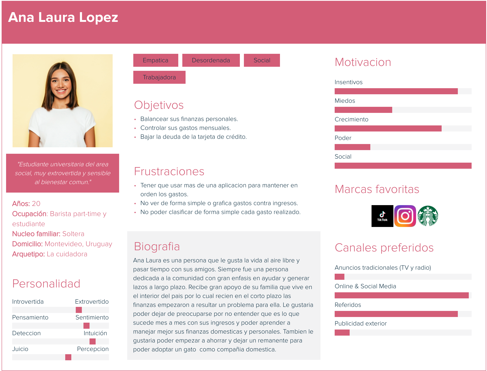

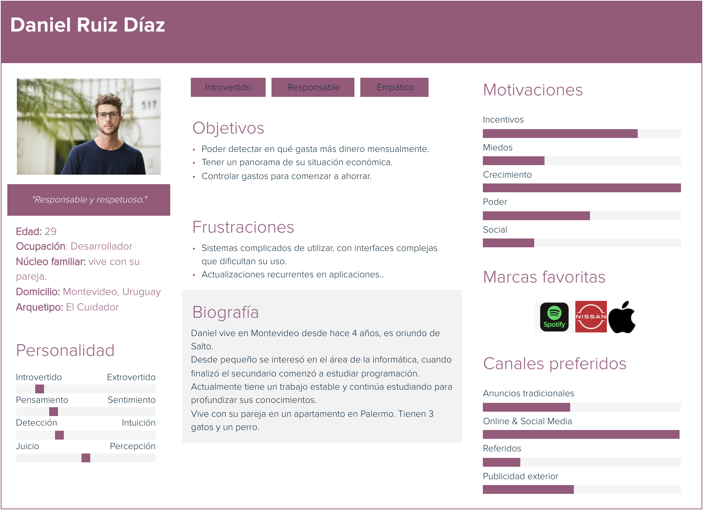

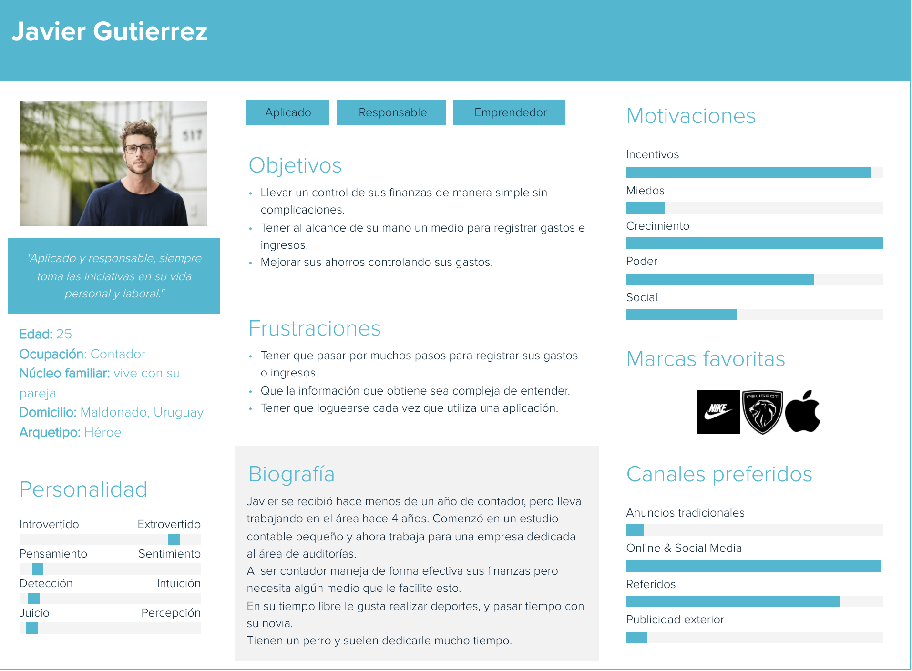

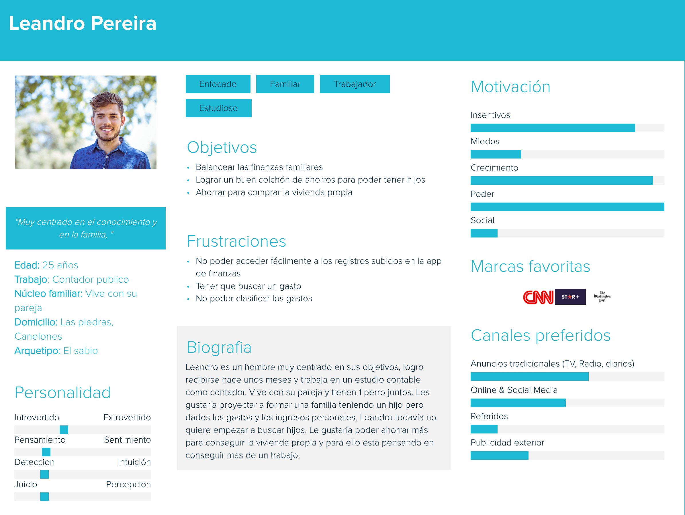

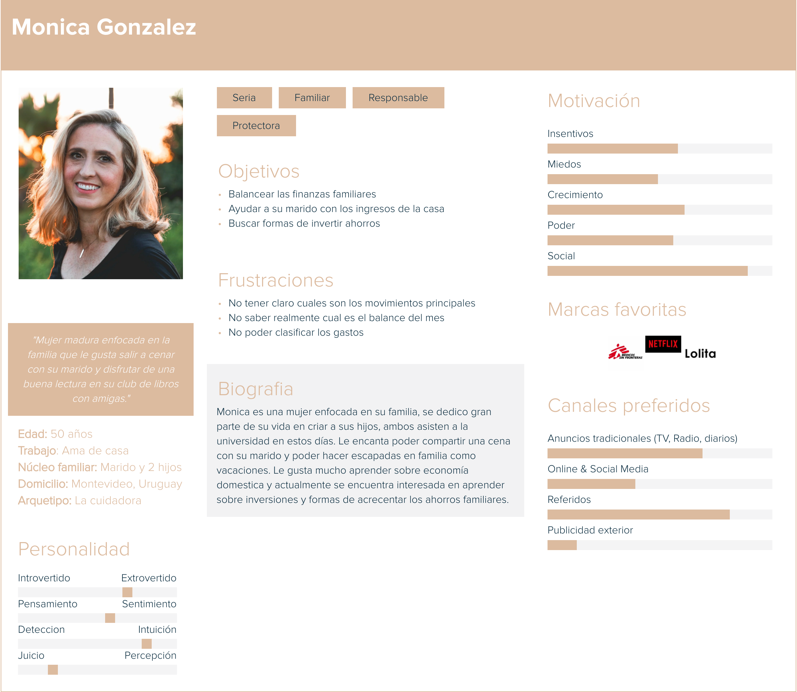

## Encuesta abierta

Como técnica extra de elicitación, se decidió hacer una encuesta abierta al público con el objetivo de recopilar información.
El eje principal de la misma estaba enfocado en determinar el interés de las personas en finanzas personales y en saber si piensan que la tecnología podría ayudar a mejorar las finanzas o llevar un orden de las mismas.

A continuación se detallan los resultados de la encuesta, vale la pena aclarar que se obtuvieron en total 99 respuestas.
Debajo de cada gráfico, se encontrarán las conclusiones a las cuales el equipo llegó.

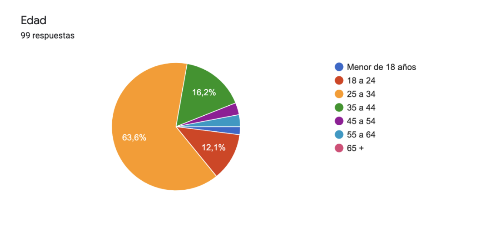

La mayor cantidad de respuestan pertenecen a personas cuyas edades están en el rango de 25 a 34 años. Esto es bueno ya que son nuestro público objetivo, personas familiarizadas con la tecnología, con una vida laboral activa.
Es muy bueno observar que también se obtuvieron buenos resultados en la franja anterior (18 a 24) y la posterior (35 a 44). Estas franjas también cumplen con algunas de las características que esperamos de nuestro publico objetivo.

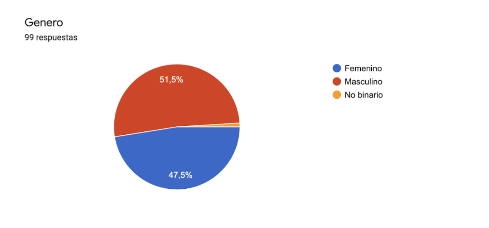

En el caso del género, no encontramos diferencias, las respuestas fueron divididas. A efectos del sistema a desarrollar, el género no hace la deiferencia, pero era muy bueno poder determinar si en realidad los datos arrojaban otra cosa, un mayor porcentaje de uno u otro. 

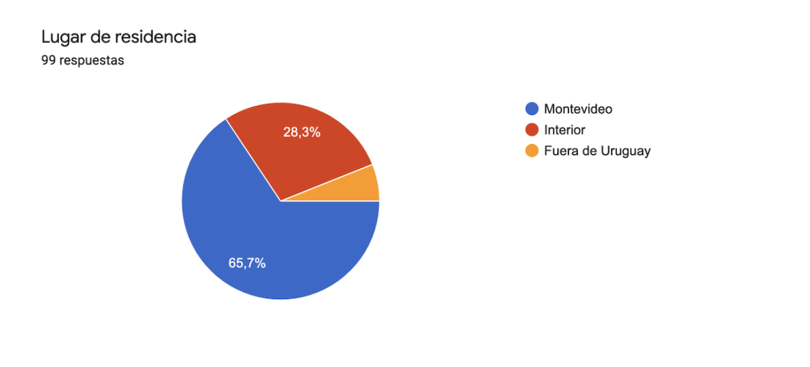

Nuestro mayor interés son las personas de nuestro mercado, es decir, Uruguay. Como se aprecia en el gráfico, un 94% de las respuestas son de personas de Uruguay. Consideramos que esto es bueno ya que nos brindará datos de mucho valor.

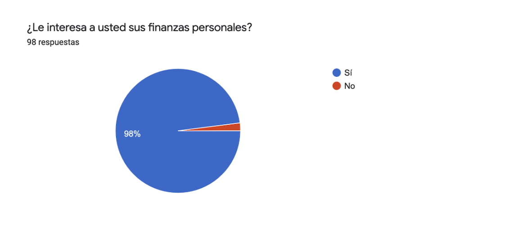

Un 98% de las personas que respondieron tienen interés en sus finanzas personales. Es un dato de mucho valor ya que son potenciales usuarios del sistema. Un interés tan marcado hace suponer que el sistema podría tener éxito.

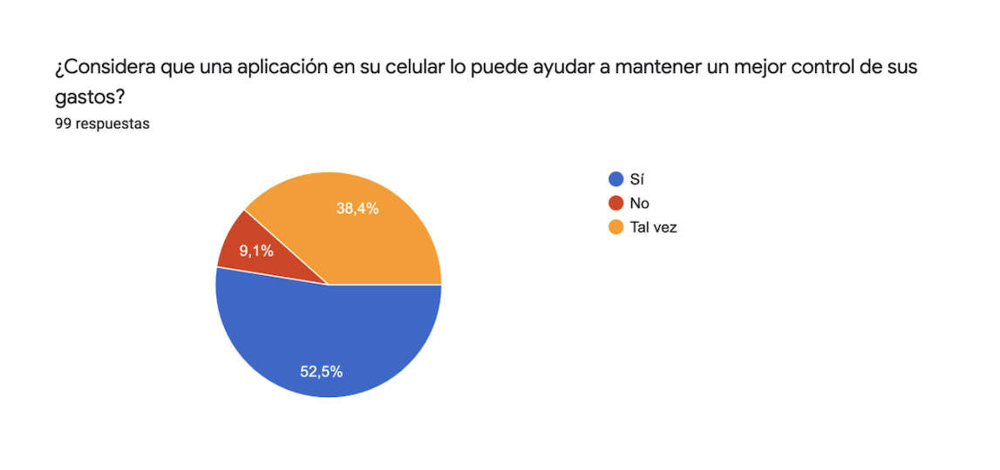

En esta respuesta se nota un poco la resistencia a la incorporación de la tecnología. Un 38,4% de las respuestas indican que no están seguros de que una aplicación les facilite el control de sus finanzas. 
Es un dato importante ya que sabemos que debemos convencerlos o mostrarles porqué un sistema en el área debería simplificar el control de sus finanzas. 

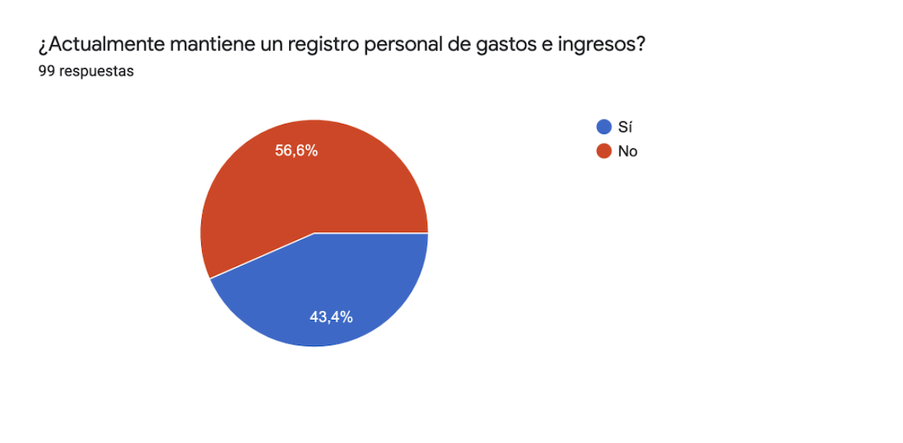

No llama la atención que estos porcentajes sean tan divididos, el registro de gastos es algo que historicamente ha sido muy complejo de lograr. Requiere de mucha disciplina y control. Nuevamente obtenemos información que nos da a entender que si bien hay mucha gente que lo hace, hay parte de nuestro público objetivo que aún se resiste a registrar este tipo de información.

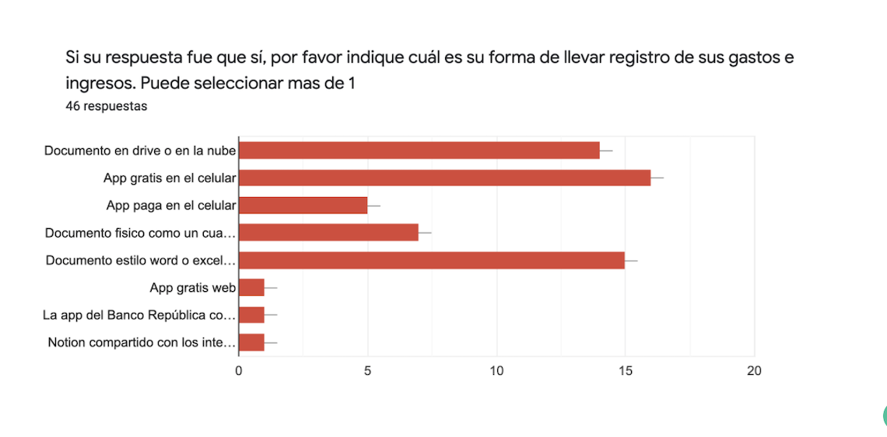

Estos resultados osn muy interesantes, vemos que hay personas que ya utilizan algún tipo de app para llevar control de sus finanzas. Esto es un buen indicador. 
También vemos otro grupo de personas que lo hace mediante documentos o planillas electrónicos, esto también es bueno, indica que están familiarizados con la tecnología y que tienen el hábito de registrar incorporado. 
Nuestra tarea tal vez pueda enfocarse en generar para estos usuarios una experiencia similar a la que obtienen con esos "documentos".

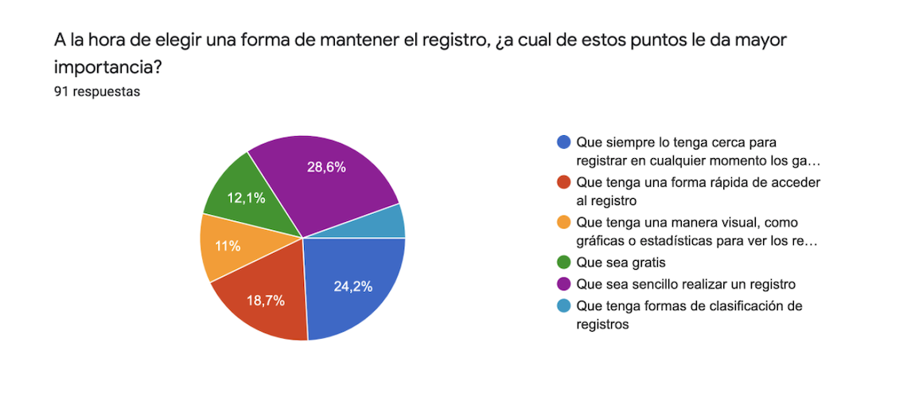

Si bien los puntos en esta pregunta son similares, hay una marcada tendencia por la practicidad y fácilidad de realizar un registro de gastos. Es sumamente importante que el usuario del sistema pueda realizar sus registros de forma fácil y rápida, si esto no ocurre, tal vez esos usuarios se conviertan en casos negativos.

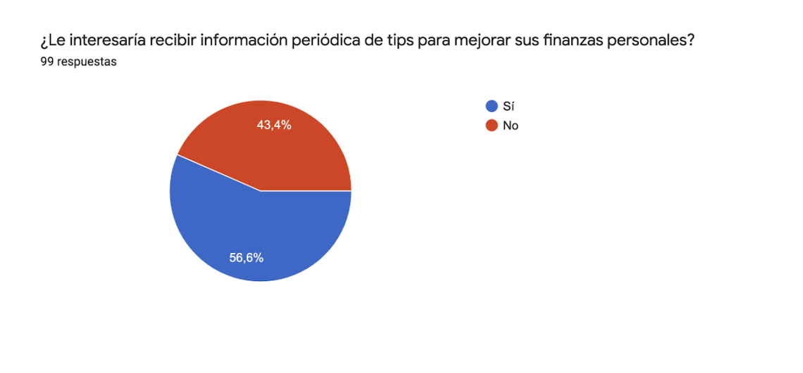

El enfoque de esta pregunta radica en determinar el interés por las finanzas y la disponibilidad para aprender sobre las mismas. 
No solo es necesario desarrollar un sistema, es necesario educar a nuestros usuarios en finanzas. Los medios pueden ser muchos, pero es optimista saber que mas de la mitad de nuestros potenciales usuarios están interesados en informarse sobre el tema.

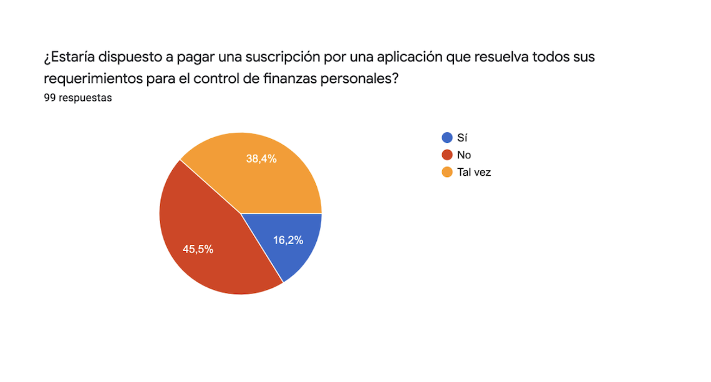

Normalmente las personas no estan dispuestas a pagar por algo que no conocen o que no les ha dado resultado. Esto es muy importante, la calidad del producto debe ser muy buena para que los usuarios se conviertan en "clientes" y paguen por utilizar un sistema. 

### Conclusión general

Basados en las respuestas y conclusiones anteriores, creemos que el desarrollo de un sistema para manejar las finanzas personales es algo qeu tiene mucho futuro, hemos visto que hoy en día no hay un sistema líder en esto.
Se siguen utilizando planillas o documentos electrónicos para este fin. 
Sabemos que para que un sistema de finanzas personales tenga éxito, debe tener un diferencial con el resto, y creemos que ese diferencial radica en la fácilidad de uso del mismo, ya que este es uno de los princioales obstáculos a la hora de generar el hábito de registro de gastos.

## Modelo Conceptual

Se trabajó en un modelo conceptual sencillo y fácil de entender.
Se modelaron 5 entidades y sus relaciones. 
Básicamente el modelo conceptual describe lo siguiente: una persona mantiene un registro de sus gastos. Ésta realiza un monitoreo de los mismos para poder tomar desiciones y mejorar de esta forma sus finanzas.

A continuación se encuentra el diagrama del modelo conceptual.

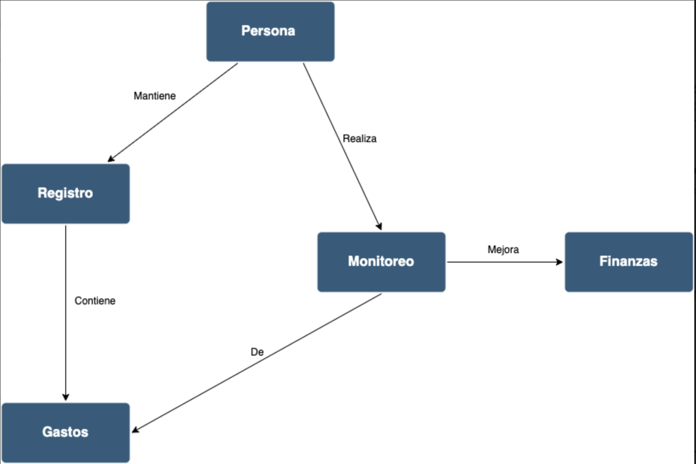

# 2) Especificación

## Definicion de requerimientos del sistema

### Requerimientos funcionales

1) El sistema deberá permitir el ingreso, modificación y eliminación de movimientos, siendo estos: gastos ó ingresos.
2) Se deberá diferenciar visualmente los gastos de los ingresos.
3) El sistema solo permite operar con una moneda a la vez.
4) El sistema deberá permitir categorizar los movimientos.
5) El sistema deberá permitir el ingreso y eliminación de categorias de movimientos.
6) El sistema permitirá listar los movimientos y filtrarlos basándose en diferentes criterios.
7) El sistema permitirá exportar el resultado de los listados en formato de hoja de cálculo.
8) El sistema ofrecerá la posibilidad de visualizar diferentes gráficos basándose en diferentes criterios.

### Requerimientos no funcionales

1) El sistema deberá ser escrito en el lenguaje **JavaScript**, utilizando **Node JS**.
2) El sistema deberá ser responsive, adaptándose a una plataforma web y mobile.
3) El sistema deberá utilizar **Material Design** como sistema de diseño.
4) El sistema deberá contar con testing unitario, utilizando para el mismo **Jest**.
5) La documentación del proyecto deberá ser escrita en formato **Markdown**.

## User Stories

**ID:** #1

**Título:** Ingreso de movimientos

**Narrtiva:** Como usuario del sistema, quiero poder registrar de forma fácil mis ingresos y egresos para poder llevar un control de los mismos.

**Criterios de aceptación:**
- Se debe permitir el registro de movimientos desde un formulario sencillo.
- Cada movimiento debe incluír: monto, descripción, tipo, categoría y fecha.
- Se debe diferenciar los movimientos del tipo "gasto" de los del tipo "ingreso".

***

**ID:** #2

**Título:** Listado de movimientos

**Narrtiva:** Como usuario del sistema, quiero poder ver una lista de todos los movimientos que ingresé.

**Criterios de aceptación:**
- Se deben listar los movimientos ordenados por fecha.
- Se debe permitir ordenar los movimientos por monto (mayor a menor).
- Se debe permitir filtrar los movimientos por período de tiempo.
- Se debe permitir filtrar los movimientos por tipo.
- Se debe permitir filtrar los movimientos por categoría.
- Los filtros son excluyentes, solo se aplica uno a la vez.

***

**ID:** #3

**Título:** Modificación de movimientos

**Narrtiva:** Como usuario del sistema, quiero poder modificar un movimiento previamente ingresado para poder corregir errores cometidos al ingresarlo.

**Criterios de aceptación:**
- Desde la lista de movimientos se debe permitir editar el movimiento seleccionado.
- La edición del movimiento permite la modificación de todos sus campos.
- La edición del movimiento se realiza en el mismo formulario de ingreso de movimientos.

***

**ID:** #4

**Título:** Eliminación de movimientos

**Narrtiva:** Como usuario del sistema, quiero poder eliminar un movimiento previamente ingresado por error.

**Criterios de aceptación:**
- Desde la lista de movimientos se debe permitir eliminar el movimiento seleccionado.
- La eliminación de un movimiento no requiere confirmación extra.

***

**ID:** #5

**Título:** Selección de moneda

**Narrtiva:** Como usuario del sistema, quiero poder seleccionar una moneda por defecto para mis gastos.

**Criterios de aceptación:**
- Se debe permitir seleccionar una moneda "general" a todo el sistema.
- Cada vez que un usuario cambia de moneda, esta se aplica a todos los movimientos.
- La selección de moneda debe estar visible desde el menú del sistema.

***

**ID:** #6

**Título:** Ingreso de categorías de movimientos

**Narrtiva:** Como usuario del sistema, quiero poder ingresar diferentes categorías para aplicar a movimientos. De esta forma puedo visualizar fácilmente en qué áreas estoy gastando mi dinero.

**Criterios de aceptación:**
- Se debe permitir ingresar una categoría para ser utilizada en la clasificación de movimientos.
- La categoría debe incluír: título, descripción y tipo.
- Los tipos de las categorías son los mismos que aplican a los movimientos: gasto ó ingreso.

***

**ID:** #7

**Título:** Listado de categorías de movimientos

**Narrtiva:** Como usuario del sistema, quiero poder ver una lista de las categorías que he ingresado, pudiendo de esta forma, decidir si necesito agregar alguna nueva o eliminar alguna existente.

**Criterios de aceptación:**
- Se deben listar las categorías por orden alfabético, usando el título para generar el orden.

***

**ID:** #8

**Título:** Eliminación de categorías de movimientos

**Narrtiva:** Como usuario del sistema, quiero poder eliminar una categoría si no necesito mas de ella.

**Criterios de aceptación:**
- Desde la lista de categorías se debe permitir eliminar una categoría seleccionada.
- La eliminación de una categoría no necesita una confirmación extra.

***

**ID:** #9

**Título:** Exportación de movimientos

**Narrtiva:** Como usuario del sistema, quiero poder exportar mis movimientos para poder trabajar con los mismos fuera del sistema.

**Criterios de aceptación:**
- Desde la lista de movimientos se debe permitir exportar la lista de movimientosa un archivo en formato CSV.
- La lista a exportar será la resultante de los filtros aplicados en el moment de hacer el "export".

***

**ID:** #10

**Título:** Visualización de movimientos en gráficos

**Narrtiva:** Como usuario del sistema, quiero ver gráficos de mis movimientos, de esta forma puedo entender visualmente en que categorías hay mas movimientos, y en hacer una comparativa de gastos mes a mes.

**Criterios de aceptación:**
- Se deberá mostrar un gráfico de "torta" de movimientos por categoría del mes actual.
- Se deberá mostrar un gráfico de "barras" de movimientos por mes. Este gráfico mostrará información de hasta 12 meses atrás.

***

**ID:** #11

**Título:** Menú

**Narrtiva:** Como usuario del sistema, quiero ver en un menú las diferentes funcionalidades que puedo hacer con el sistema. 

**Criterios de aceptación:**
- Se deberá incluír un menú de usuarios para dar fácil acceso a las funcionalidades del sistema.
- El menú deberá incluír: "Movimientos", "Categorías", "Moneda" y "Gráficos".

## User Cases

**Título:** Ingreso de movimiento

**Actor:** Usuario del sistema

**Curso Normal:**

| Acción de los actores | Respuesta del sistema |
|----------|------------|
| 1. Presiona "Movimientos" en el menú | 2. Se abre la pantalla de "Movimientos" |
| 3. Presiona el botón de "Agregar movimiento" | 4. Se despliega el formulario de ingreso de movimiento |
| 5. Completa los datos del movimiento |  |
| 6. Presiona "Guardar movimiento" | 7. Se guarda el movimiento y se muestra la pantalla de "Movimientos" |

**Curso alterno**

7.1: El sistema no puede guardar el movimiento, el usuario continúa viendo el formulario con los datos ingresados.

****

**Título:** Listado de movimientos

**Actor:** Usuario del sistema

**Curso Normal:**

| Acción de los actores | Respuesta del sistema |
|----------|------------|
| 1. Presiona "Movimientos" en el menú | 2. Se abre la pantalla de "Movimientos" |
|  | 3. Se muestra la lista de movimientos |

**Curso alterno**

3.1: Aún no hay movimientos, se muestra un mensaje: "Aún no se han registrado movimientos.".

****

**Título:** Modificación de movimiento

**Actor:** Usuario del sistema

**Curso Normal:**

| Acción de los actores | Respuesta del sistema |
|----------|------------|
| 1. Presiona "Movimientos" en el menú | 2. Se abre la pantalla de "Movimientos" |
| 3. Selecciona un movimiento a modificar | 4. Se muestra un formulario con los campos del movimiento a modificar |
| 5. Se modifican los campos del formulario | |
| 6. Presiona "Guardar movimiento" | 7. Se guarda el movimiento y se muestra la pantalla de "Movimientos" |

**Curso alterno**

7.1: El sistema no puede guardar el movimiento, el usuario continúa viendo el formulario con los datos ingresados.

****

**Título:** Eliminación de movimiento

**Actor:** Usuario del sistema

**Curso Normal:**

| Acción de los actores | Respuesta del sistema |
|----------|------------|
| 1. Presiona "Movimientos" en el menú | 2. Se abre la pantalla de "Movimientos" |
| 3. Selecciona un movimiento a eliminar | 4. Se elimina el movimiento |
|  | 5. Se muestra la pantalla de "Movimientos" |

**Curso alterno**

4.1: El sistema no puede eliminar el movimiento, se muestra la pantalla de "Movimientos".

****

    