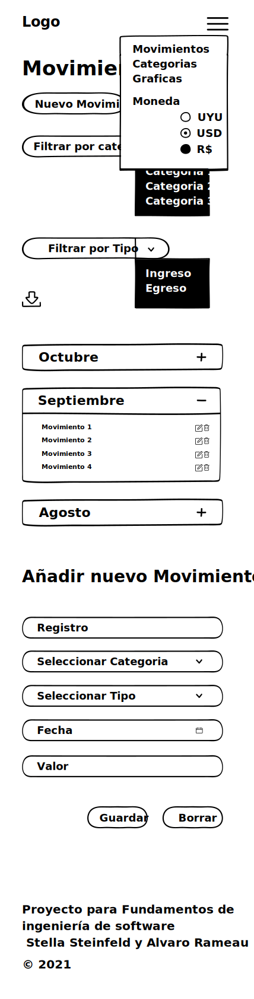
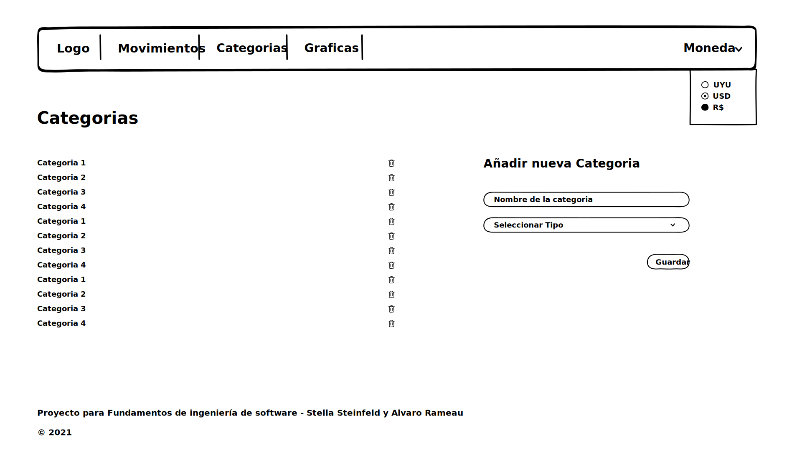
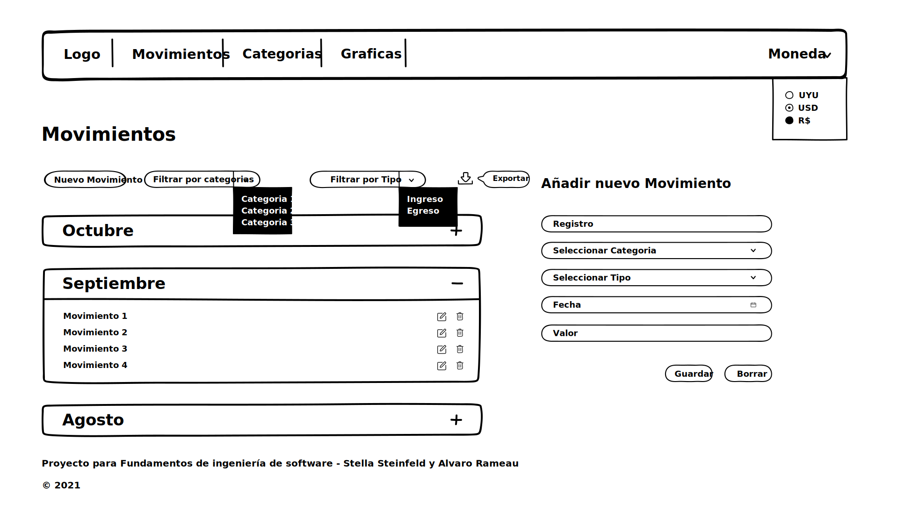
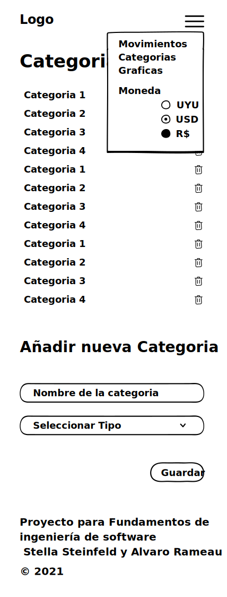
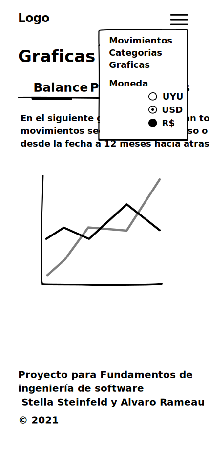
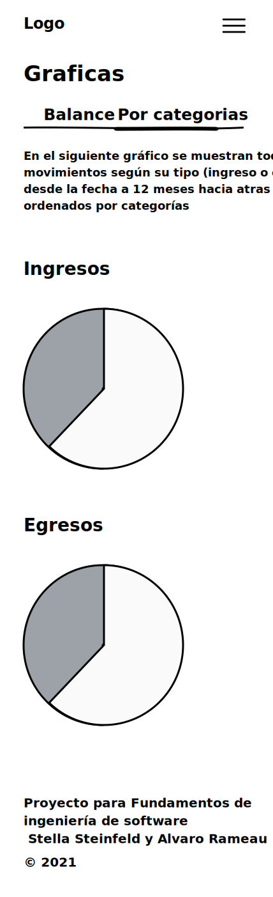

## Introduccion

En esta carpeta estan subidos los svg de los wareframes creados como bocetos para la UI de la aplicacion

### Diseños para Mobile:

#### Pagina de movimientos:

#### Pagina de categorias:

#### Pagina de graficas, seccion Balance:

#### Pagina de graficas, seccion por Categorias:

### Diseños para Web:

#### Pagina de movimientos:

#### Pagina de categorias:

#### Pagina de graficas, seccion Balance:

#### Pagina de graficas, seccion por Categorias:

