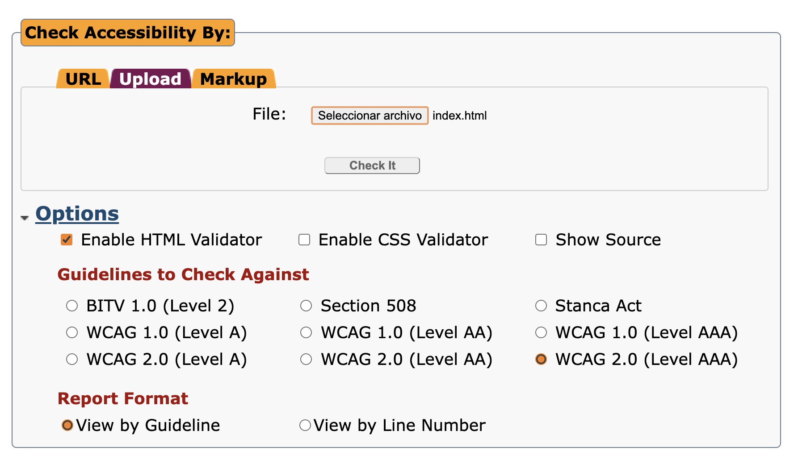
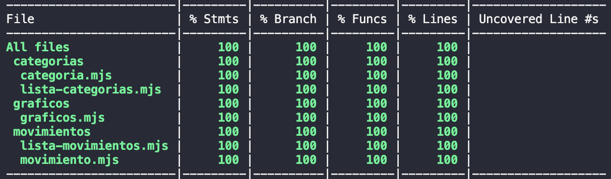

# Informe académico entrega 2
Fecha de entrega: 29-nov-2021

## Construcción

### Implementación de funciones principales:
Debemos mencionar cambios en el alcance del proyecto, durante el desarrollo quitamos algunas funcionalidades, ya sea por falta de tiempo o porque se evaluó nuevamente y entendimos que no aportaban valor por sí mismas.

A continuación se detallan las user stoy que no fueron implementadas:
- **2 - Listado de Movimientos**: con respecto a esta user story, la funcionalidad general de listar los movimientos y ordenarlas por fecha esta implementado pero la parte de los filtros extra se decidio quitar del scope del proyecto para poder optimizar tiempos y concentrarnos en las funcionalidades ya implementadas mejorando los issues y el testeo de los mismos.
- **5 - Selección de moneda**: el equipo comenzó la implementación de la funcionalidad pero luego de una evaluación determinamos que no aportaba valor ninguno. Para que el uso de múltiples monedas tenga sentido es necesario que esta funcionalidad sea completa, es decir, que no sea un simple selector, sino que aporte valor al sistema (conversión de moneda, soporte de gastos en distintas monedas, etc.).
- **9 - Exportación de movimientos**: si bien esta funcionalidad fue implementada, debemos mencionar que se hizo una modificación, en la user story se menciona que el documento a descargar es en formato CSV, pero en la implementación el formato es un archivo compatible con Excel.
- **10 - Visualización de movimientos en gráficos**: esta funcionalidad también sufrió modificaciones, se imlementó el gráfico de balance y el gráfico de movimientos por categoría pero solo para egresos. Se decidió recortar esta funcionalidad por falta de tiempo y problemas en la implementación.

### Configuración de plataforma tecnológica para desarrollo y producción 

Ver: [Desarrollo / Producción](../install.md)

### Uso de librerías externas (package.json)

**chart.js**: Esta librería fue utilizada para el manejo de gráficos, es una librería muy conocida que cuenta con mucho soporte. Es fácil de implementar y tiene muchas funcionalidades para customizar los gráficos.

https://www.chartjs.org/

El resto de las librerías en package.json son parte de la plantilla original del proyecto, el equipo no introdujo ninguna otra dependencia.

## Interfaz de usuario

### Interfaz de usuario web / mobile (responsive)

Al usar MDWC fue muy fácil poder hacer un diseño responsivo de la aplicación, ya que los componentes de Material UI son responsive. Igualmente fue debidamente probado a la hora de desarrollar.
Se siguieron las pautas de estilos que se pedía en la letra del obligatorio, utilizando los colores y fuentes que en esta se detallaban. Se utilizó el sistema de colores de Material para valernos de colores auxiliares.

Vale aclarar que respecto a la parte responsive entendemos que el sitio cumple las especificaciones pero sabemos que tiene muchas oportunidades de mejora.

### Estándar de accesibilidad WCAG

**Plataforma utilizada para la verificación de estándares:** 

https://achecker.achecks.ca/checker/index.php

**Configuración del validador:**

**Resultados de la validación:** 

[Know problems](../docs/accesibilidad/Know_problems.pdf) (9)

[Potetial problems](../docs/accesibilidad/Potential_Problems.pdf) (37)

Si debemos tener una conclusión final sobre la accesibilidad, estamos medianamente conformes, entendemos que hay problemas y potenciales problemas que no fueron resueltos por falta de atención por parte del equipo.

## Codificación

IDE Visual Studio Code: configuración común del equipo

### Estándares de codificación Google (HTML, CSS, JavaScript)
Como estandares usamos las buenas practicas aprendidas en clase para la codificacion. A su vez en CSS usamos el pre codigo Sass indentando el mismo en modulos donde quede mas claro donde se anidan cada uno de los componentes.

### Buenas prácticas de OOP: separación de lógica e interfaz
Para el dominio dividimos el codigo armando para cada sección una carpeta. En interfaz mantuvimos el codigo dividido como ya estaba, estilos, scripts, etc. Lo que si intentamos fue que cada seccion tuviera su archivo para que el mantenimiento del codigo sea mas facil y accesible.

### Análisis estático de código: mostrar reducción de problemas
Se utilizaron plugins de reporte de problemas en el codigo como SonarLint y LintJS.

## Test unitario

### Test unitarios en Jest
Todas las secciones del dominio cuentan con un archivo Jest para los test unitarios que fueron debidamente corridos previo al code freeze

## Test de sistema

Tenemos un entorno de _desarrollo_ y uno de producción. En el ultimo el código generado no tiene comentarios y está mimificado para poder emular lo mejor posible un servidor web activo.

### Sesiones de prueba exploratoria

[Sesión "Movimientos"](../docs/testing/Sesion_Movimientos_Stella_Steinfeld.pdf)
[Sesión "Categorias"](../docs/testing/Sesion_Categorias_Stella_Steinfeld.pdf)
[Sesión "Gráficas"](../docs/testing/Sesion_Alvaro_Rameau.pdf)

## Reporte de issues

Cada issue está debidamente reportado en github.
Se definieron labels para la severidad del issue y para el dominio del mismo. Entre estos encontramos: **Interfaz HTML/CSS, FuncionalidadesJS, Alta, Media, Baja**.

#### Issues reportados por tipo: 

|Tipo|Total|
|---|---|
|Interfaz HTML/CSS|3|
|FuncionalidadesJS|1|

#### Issues reportados por severidad:

|Nivel|Total|
|---|---|
|Alta|1|
|Media|1|
|Baja|2|

Como evaluación global de la calidad, estamos conformes con lo entregado ya que conocemos los issues reportados y las features faltantes. Las features faltantes fueron decididas por el equipo para poder dedicarnos a realizar un código de calidad y una Aplicación que cumpla con nuestras expectativas.

## Reflexión

### Reflexión general
En esta segunda instancia aprendimos mucho, y no solo por el conocimiento teórico aplicado, sino también por ciertos inconvenientes que tuvimos en el desarrollo del proyecto. 
Casi al final de la entrega, se incorporó un nuevo compañero al equipo, esto implicó dedicar algunas horas de trabajo en conjunto para que los tres integrantes estemos alineados. Además de esto, tuvimos dificultades con el entorno de desarrollo lo que implicó que el nuevo integrante no pueda trabajar de manera cómoda y fluída, esto no quiere decir que no tuvo participación, sino que por la falta de tiempo se hizo complejo solucionar determinados problemas.
En resumen general creemos que fue una instancia muy rica, ponerse en el lugar de cada uno de los aactores que intervienen en el desarrollo de software fue muy valioso, nos permite entender y dimensionar el trabajo y esfuerzo de cada parte para lograr un objetivo en común.

### Reflexionez individuales
**Alvaro Rameau**: Toda la instancia me pareció muy valiosa, pero personalmente destaco la parte de testing unitario. Me aportó muchísimo conocimiento y práctica para poder aplicar en el ámbito laboral. Si bien ya me había enfrentado en el trabajo al testing, nunca lo había hecho desde cero. Destaco y aplaudo que el curso incluya este módulo, ya que sé que es necesario para el trabaajo y sé que en muchos lugares se pide personal no solo con conocimientos de programación, sino también con conocimientos de testing.

**Stella Steinfeld**: En lo personal, al igual que Alvaro yo ya estaba familiarizada con el uso de JS y Sass ya que ambos lenguajes los utilizo en el dia a dia para desarrollar en el trabajo. Pero la parte de test automatizados fue algo que rescato mucho y la creacion de reportes de issues en github igual ya que muchas veces son cosas que el desarrollador en si no realiza tanto. También fue un buen desafio el pensar en los tiempos y en la planificacion de todo el proyecto para tener una Aplicacion entregable y usable al final del proceso. 

**Juan Romero**: Desde mi perspectiva, no tenía tanta experiencia en el uso de otros lenguajes aparte de JS antes de esto, teniendo más que nada conocimientos bastante básicos. El ver la manera en la que lo aprendido en el curso acerca del testing se pone en práctica a la hora de trabajar me sorprendió bastante, ya que anteriormente no tenía tanto en cuenta esos factores. Fue bueno trabajar con compañeros que tenían un estilo de codificación diferente del mío, ya que fue útil para familiarizarme más con técnicas que desconocía. El pensar en los tiempos y la planificación fue bueno para conocer mejor cómo funciona la programación a un nivel más profesional, a pesar de que lo puedo considerar un desafío debido a que tenía la costumbre de usar otro ritmo.

### Técnicas aplicadas y aprendizajes
Aplicamos gran parte de las tecnicas aprendidas. Mejoramos la division del codigo para que se armen celulas mas pequeñas y que asi se pueda mantener el codigo y sea mas facil el desarrollo. Hicimos tests automatizados con Jest, que fue un gran aprendizaje para todo el equipo ya que no era nuestro fuerte previo a la realizacion de esta tarea. Procuramos que cada metodo desarrollado explique por si solo su funcionamiento a traves del nombre y el codgio claro, pero en algunos casos como teniamos que realizar HTML dinamico con varias lineas de codigo ayudamos colocando comentarios en el codigo. Tanto Alvaro como Stella estamos muy acostumbrados al desarrollo con Sass y Javascript dados los trabajos actuales, por ello que en esta area tenemos un poco mas de experiencia. Vale destacar tambien que el uso de github para el reporte de Issues y la forma completa de reportarlos tambien fue un aprendizaje muy util para el desarrollo de este proyecto y de los siguientes que tendremos. Para la division de trabajo y planificacion de las tareas realizamos un board en Trello. Esto nos ayudo mucho para saber en que estaba trabajando cada uno y en que estado estaba el proyecto. Tambien nos pusimos un limite de fechas a entregar cada tarea para que el code freeze no nos tomara apretados de tiempo https://trello.com/invite/b/D58t6A2T/b7d6c1a44f038e0ad16f9ea0f91460ac/fis-2entrega este es el link en caso de que quiseran ver el trabajo. En cada tarjeta fuimos dejando comentarios para el momento de documentar el proceso ya que asi usabamos todo el tiempo disponible para desarrollar y mejorar el codigo. Para la creacion de los ambientes de desarrollo y produccion usamos este sitio web de referencia https://jonmircha.com/webpack Tambien por un tema de tiempos, complejidad decidimos cortar del scope algunas funcionalidades de la aplicacion. Como los filtros que habiamos diseñado y agregado a las user history. Preferimos enfocarnos en testear y no agregar mas funcionalidades ya para el final del proceso. Lo mismo sucedio con la seleccion de moneda, que en esta iteracion del proyecto la idea era solo poner una moneda fija sin que afectara en nada el cambio y ello. Vale aclarar que para la ultima semana decidimos integrar al equipo a Juan y tuvimos varias reuniones con el y tiempo para poder explicarle como levantar el proyecto y explicarle el codigo.
