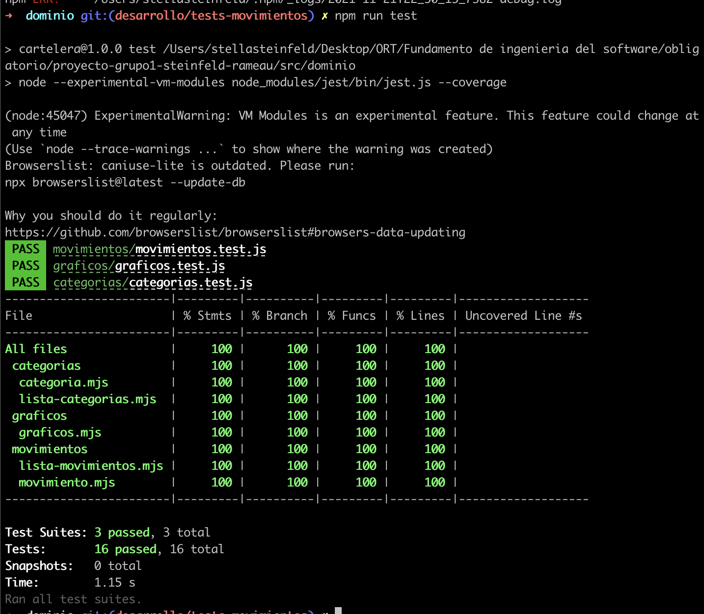

# Informe académico entrega 2
Fecha de entrega: 29-nov-2021

## Construcción

Implementación de funciones principales (sin la necesidad de persistencia de datos)

Configuración de plataforma tecnológica para desarrollo y producción

Documentación del uso de librerías externas (package.json)

## Interfaz de usuario

Interfaz de usuario web / mobile (responsive)

Página única con navegación entre secciones

Implementación: Material Design Web Components

Aplicar un sistema de diseño y principios de usabilidad

Cumplimiento de estándar de accesibilidad WCAG

Seguir especificación de estilo

## Codificación

IDE Visual Studio Code: configuración común del equipo
Configuramos el IDE con los siguientes parametros:

Estándares de codificación Google (HTML, CSS, JavaScript)
Como estandares usamos las buenas practicas aprendidas en clase para la codificacion. A su vez en CSS usamos el pre codigo Sass indentando el mismo en modulos donde quede mas claro donde se anidan cada uno de los componentes.

Buenas prácticas de OOP: separación de lógica e interfaz
Para el dominio dividimos el codigo armando para cada seccion una carpeta. En interfaz mantuvimos el codigo dividido como ya estaba, estilos, scripts, etc. Lo que si intentamos fue que cada seccion tuviera su archivo para que el mantenimiento del codigo sea mas facil y accesible.

Análisis estático de código: mostrar reducción de problemas
Se utilizaron plugins de reporte de problemas en el codigo como SonarLint y LintJS.

## Test unitario

Test unitarios en Jest
Todas las secciones del dominio cuentan con un archivo Jest para los test unitarios que fueron debidamente corridos previo al code freeze

100% cobertura en clases de dominio

| En la semana previa a la entrega se debe congelar el desarrollo (22-nov-2021).
A partir de este punto solo se realizan actividades de test de sistema, reporte de issues y generación del informe académico.

## Test de sistema

Realizar test de sistema en un entorno separado del desarrollo

Generar casos de prueba aplicando técnica partición equivalente

Detallar sesiones de prueba exploratoria

## Reporte de issues

Reportar issues (bugs, improvements, missing features) en GitHub 

Aplicar buenas prácticas de reporte de issues

Definir labels para tipos de issue y niveles de severidad

Dejar issues abiertos para correcciones o mejoras futuras

Sumarizar número de issues reportados por tipo

Realizar una evaluación global de la calidad

## Reflexión

Detalle del trabajo individual
Stella Steinfeld: Desarrollo e implementacion de pagina categorias y movimientos.
Alvaro Rameau: Desarrollo e implementacion de Layout (diseños base del sitio) y Seccion Graficas.
Cada tarea esta dividida en el board de trello asignada a su repesctivo desarrollador.
La parte de testing, testeos de caja negra, creacion de issues y documentacion fue en conjunto ya que no importaba quien lo haya desarrollado.

Técnicas aplicadas y aprendizajes
Aplicamos gran parte de las tecnicas aprendidas. Mejoramos la division del codigo para que se armen celulas mas pequeñas y que asi se pueda mantener el codigo y sea mas facil el desarrollo. Hicimos tests automatizados con Jest, que fue un gran aprendizaje para todo el equipo ya que no era nuestro fuerte previo a la realizacion de esta tarea. Procuramos que cada metodo desarrollado explique por si solo su funcionamiento a traves del nombre y el codgio claro, pero en algunos casos como teniamos que realizar HTML dinamico con varias lineas de codigo ayudamos colocando comentarios en el codigo. Tanto Alvaro como Stella estamos muy acostumbrados al desarrollo con Sass y Javascript dados los trabajos actuales, por ello que en esta area tenemos un poco mas de experiencia. Vale destacar tambien que el uso de github para el reporte de Issues y la forma completa de reportarlos tambien fue un aprendizaje muy util para el desarrollo de este proyecto y de los siguientes que tendremos. 
Para la division de trabajo y planificacion de las tareas realizamos un board en Trello. Esto nos ayudo mucho para saber en que estaba trabajando cada uno y en que estado estaba el proyecto. Tambien nos pusimos un limite de fechas a entregar cada tarea para que el code freeze no nos tomara apretados de tiempo
https://trello.com/invite/b/D58t6A2T/b7d6c1a44f038e0ad16f9ea0f91460ac/fis-2entrega este es el link en caso de que quiseran ver el trabajo.
En cada tarjeta fuimos dejando comentarios para el momento de documentar el proceso ya que asi usabamos todo el tiempo disponible para desarrollar y mejorar el codigo.
Para la creacion de los ambientes de desarrollo y produccion usamos este sitio web de referencia https://jonmircha.com/webpack
Tambien por un tema de tiempos, complejidad decidimos cortar del scope algunas funcionalidades de la aplicacion. Como los filtros que habiamos diseñado y agregado a las user history. Preferimos enfocarnos en testear y no agregar mas funcionalidades ya para el final del proceso. Lo mismo sucedio con la seleccion de moneda, que en esta iteracion del proyecto la idea era solo poner una moneda fija sin que afectara en nada el cambio y ello.
Vale aclarar que para la ultima semana decidimos integrar al equipo a Juan y tuvimos varias reuniones con el y tiempo para poder explicarle como levantar el proyecto y explicarle el codigo.

